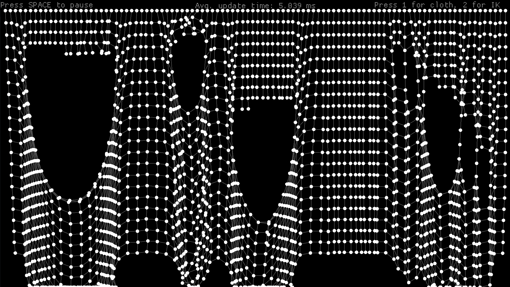
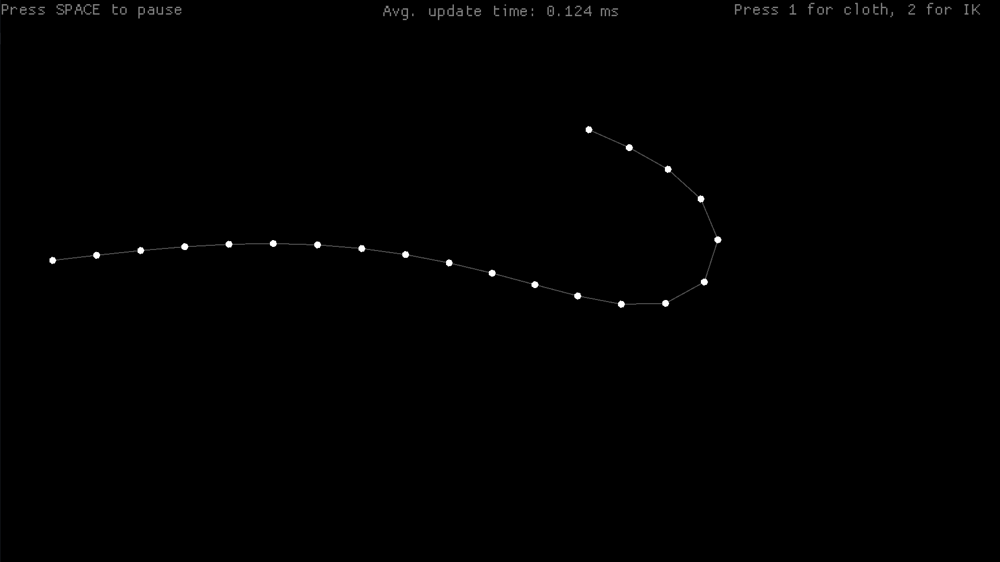

# Verlet Simulation with WASM support
A small verlet simulation, written to explore verlet integration. It uses `macroquad` for simple rendering and input handling.

There are two scenarios. A cloth simulation:

And a small inverse kinematics (FABRIK) implementation:
